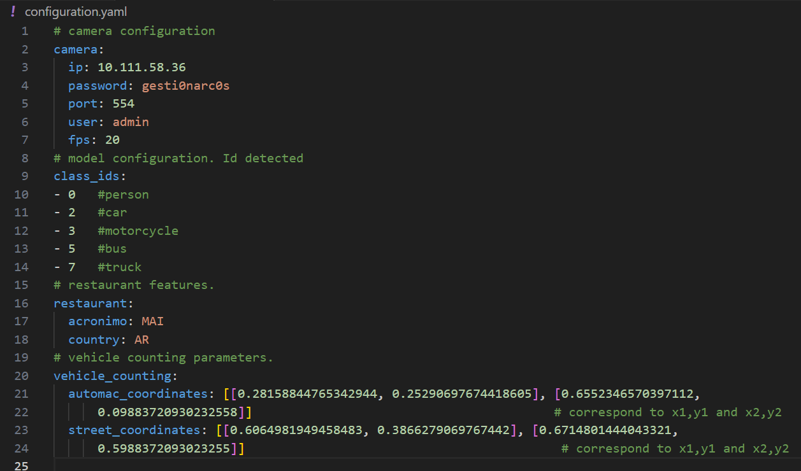

# vehicle_counter_configure
Open the configuration.yaml file and modify the IP camera configuration (port/ip/psasword/etc)

Open the window running the command:

```
python "vehicle_counter_configure.py"
```

Make sure that all dependencies detailed in the file "requirements.txt" are installed.


Load the YAML configuration file and press the button "Add Lines".


You can then select a line of interest and drag the line to the position you want  using the "draggable" dots.


To finish press the save button. note that comments in the yaml file will remain unchanged.